# System Architecture: Geotab Add-In Generator

This document outlines the multi-agent system architecture for the automated generation of Geotab Add-Ins.

## Flow Diagram

The system follows a sequential workflow managed by an Orchestrator Agent, with feedback loops for quality assurance. The communication protocol between agents is MCP (Multi-Agent Communication Protocol).

```mermaid
graph TD
    subgraph "Input & Orchestration"
        User[("👤 User")]
        Orchestrator(Orchestrator Agent)
        LLM[("Gemini LLM")]
    end

    subgraph "Development Pipeline"
        Analyst(Analyst)
        Designer(Designer)
        Coder(Coder)
        Tester(Tester)
    end
    
    subgraph "Deployment"
        Deployer(Deployer)
        AddIn{{"</> Deployed Add-In"}}
    end

    User -- "Natural Language Request" --> Orchestrator
    Orchestrator -- "Gets High-Level Plan" --> LLM
    
    Orchestrator -- "Initiates Pipeline" --> Analyst
    Analyst -- "Specifications" --> Designer
    Designer -- "Technical Design" --> Coder
    Coder -- "Generated Code" --> Tester
    
    Tester -- "Bugs Found (Iterate)" --> Coder
    Tester -- "Code Approved" --> Deployer
    
    Deployer -- "Packages & Deploys" --> AddIn
    AddIn --> Orchestrator
    Orchestrator -- "Notifies User" --> User
```

## Agent Responsibilities

*   **Orchestrator Agent**: Manages the overall workflow, communicates with the LLM, and delegates tasks to specialist agents.
*   **Analyst Agent**: Transforms the user's request into detailed functional specifications.
*   **Designer Agent**: Creates the technical architecture and UI/UX design based on the specifications.
*   **Coder Agent**: Writes the source code based on the technical design.
*   **Tester Agent**: Validates the generated code against specifications and reports bugs.
*   **Deployer Agent**: Packages the final code for deployment.