# 🏗️ Arquitectura del Sistema "Geotab Genesis"

El sistema utiliza un `OrchestratorAgent` para dirigir el flujo de trabajo, desde la interpretación de la solicitud del usuario hasta el despliegue final del Add-In.

```mermaid
graph TD
    subgraph "Usuario"
        A[Usuario envía Prompt a la UI]
    end

    subgraph "Servidor (FastAPI)"
        B(Endpoint /generate-addin)
    end

    subgraph "Sistema de Agentes: Geotab Genesis"
        C[OrchestratorAgent]
        D[CoderAgent]
        E[DeployerAgent]
        F{"LLM Provider (Gemini)"}
        G[BaseAgent]

        B -- 1 Inicia Orquestador --> C

        C -- 2 Genera Plan y Diseño Técnico --> F
        F -- 3 Devuelve Diseño (HTML/CSS/JS) --> C

        C -- 4 Pasa Diseño a Coder --> D
        D -- 5 Escribe archivos en ./output --> H(Directorio ./output)

        C -- 6 Pasa ruta de código a Deployer --> E
        E -- 7 Copia archivos a Repo Local --> I(Repo Local de GitHub Pages)
        I -- 8 Actualiza config.json --> I
        E -- 9 Git Push --> J((GitHub))
        J -- 10 Despliega en GitHub Pages --> K((URL Pública))
        E -- 11 Hace Polling a la URL --> K
    
        C -- hereda de --> G
        D -- hereda de --> G
        E -- hereda de --> G
        G -- usa --> F
    end

    A --> B
    E -- 12 Devuelve resultado final --> C
    C -- 13 Devuelve JSON a FastAPI --> B
    B -- 14 Devuelve JSON a UI --> A

    style F fill:#f9f,stroke:#333,stroke-width:2px
    style J fill:#bbf,stroke:#333,stroke-width:2px
    style K fill:#9f9,stroke:#333,stroke-width:2px
```

