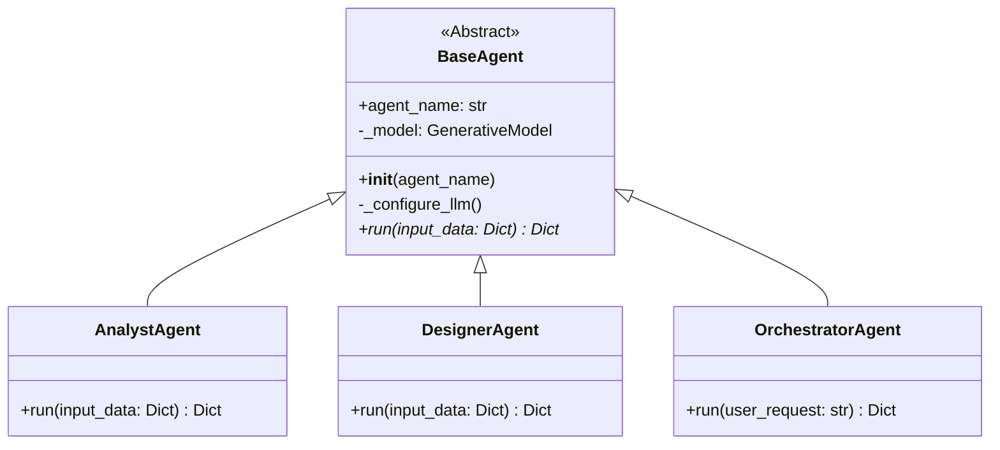

# Diseño del Agente Base (BaseAgent)

Este documento describe el rol y la estructura de la clase `BaseAgent`, que es la plantilla fundamental para todos los agentes del sistema.

## Propósito

La clase `BaseAgent` tiene dos responsabilidades principales:

1.  **Proveer Funcionalidad Común**: Centraliza la lógica que todos los agentes necesitan, como la configuración del cliente del LLM (`_configure_llm`), evitando la duplicación de código.
2.  **Definir una Interfaz Común**: Actúa como una clase base abstracta que obliga a todas las subclases a implementar un método `run()`. Esto garantiza que el orquestador pueda interactuar con cualquier agente de manera uniforme.

## Diagrama de Clases

El siguiente diagrama muestra cómo los agentes especializados (`AnalystAgent`, `DesignerAgent`, `OrchestratorAgent`, etc.) heredan de `BaseAgent`.

