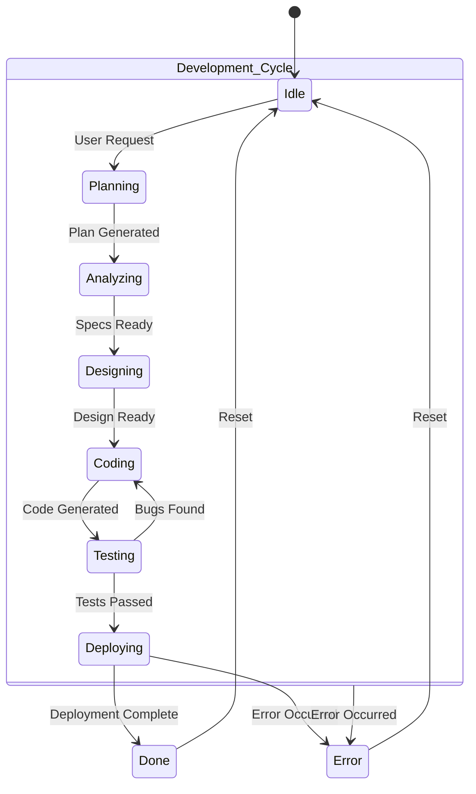

# Orchestrator Agent Design

This document details the internal logic of the Orchestrator Agent, which functions as a state machine to manage the lifecycle of an Add-In creation request.

## State Machine Diagram

The Orchestrator transitions between states based on the successful completion of tasks by the specialist agents or in response to errors.

## State Descriptions

*   **Idle**: The initial state. The agent is waiting for a new request.
*   **Planning**: The agent interacts with the LLM to analyze the user request and create a high-level plan.
*   **Analyzing**: The `Analyst Agent` is tasked with creating detailed specifications.
*   **Designing**: The `Designer Agent` is tasked with creating the technical design.
*   **Coding**: The `Coder Agent` is tasked with writing the source code.
*   **Testing**: The `Tester Agent` validates the code. The cycle can return to `Coding` if bugs are found.
*   **Deploying**: The `Deployer Agent` packages the final, approved code.
*   **Done**: The final success state. The process is complete.
*   **Failed**: A terminal state for any unrecoverable error during the process.