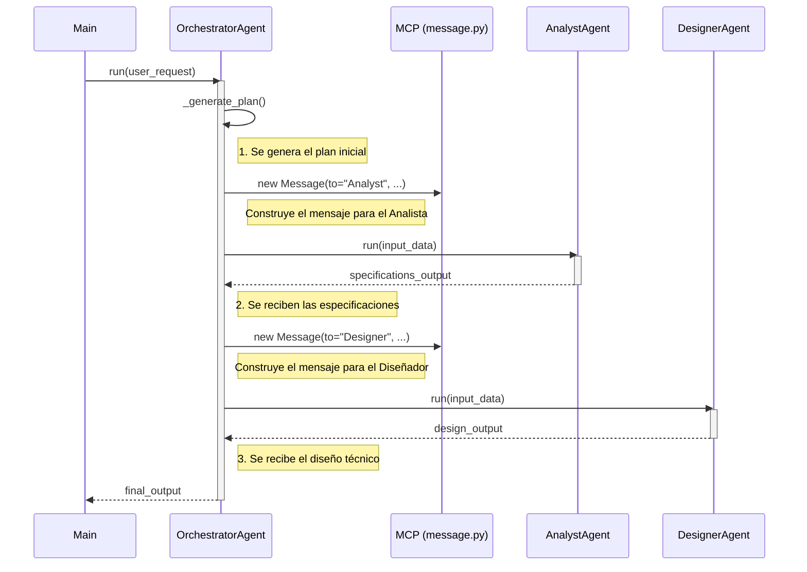

# Diseño de Interacción del Orquestador

Este documento detalla cómo el `OrchestratorAgent` utiliza el Protocolo de Comunicación Multi-Agente (MCP) para gestionar el flujo de trabajo.

## Propósito

Mientras que el `ORCHESTRATOR_DESIGN.md` muestra la máquina de estados interna, este diagrama de secuencia se enfoca en las interacciones en tiempo de ejecución. Muestra cómo el orquestador construye y gestiona los objetos `Message` (definidos en `mcp/message.py`) para comunicarse con los agentes especializados.

## Diagrama de Secuencia

